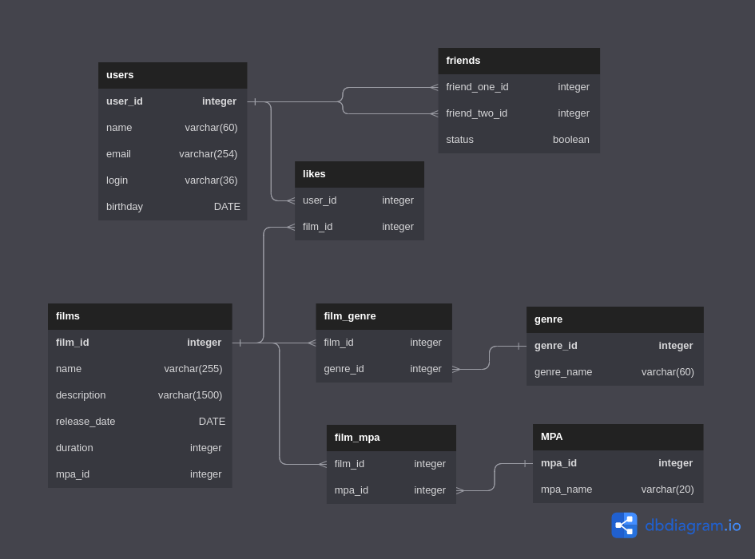

# java-filmorate

### Описание ER-диаграммы:

###### Таблица film
- ***film_id*** - уникальный идентификатор фильма
- ***name*** - название фильма
- ***description*** - писание фильма
- ***release_date*** - дата релиза фильма
- ***duration*** - продолжительность фильма

###### Таблица user
- ***user_id*** - уникальный идентификатор пользователя
- ***name*** - имя  пользователя
- ***email*** - электронная почта пользователя
- ***login*** - логин пользователя
- ***birthday*** - дата рождения пользователя

###### Таблица likes
- ***user_id*** - идентификатор пользователя
- ***film_id*** - идентификатор фильма

###### Таблица MPA
- ***mpa_id*** - уникальный идентификатор рейтинга
- ***name*** - название рейтинга

###### Таблица film_mpa
- ***film_id*** - идентификатор фильма
- ***mpa_id*** - идентификатор рейтинга

###### Таблица genre
- ***genre_id*** - уникальный идентификатор жанра
- ***name*** - название жанра

###### Таблица film_genre
- ***film_id*** - идентификатор фильма
- ***genre_id*** - идентификатор жанра

###### Таблица friends_user
- ***friend_one_id*** - идентификатор пользователя с исходящим запросом дружбы
- ***friend_two_id*** - идентификатор пользователя с входящим запросом дружбы
- ***status*** - взаимная подписка